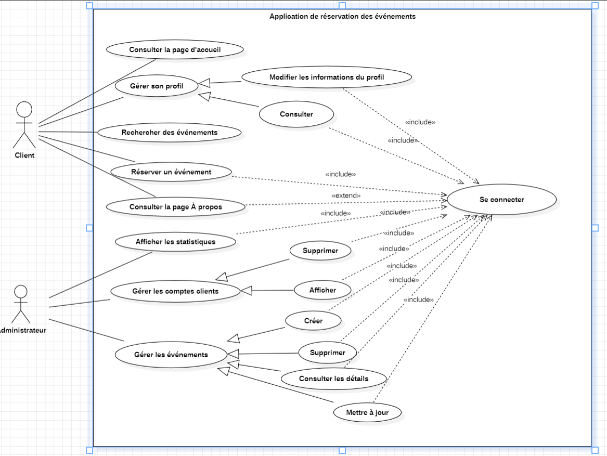
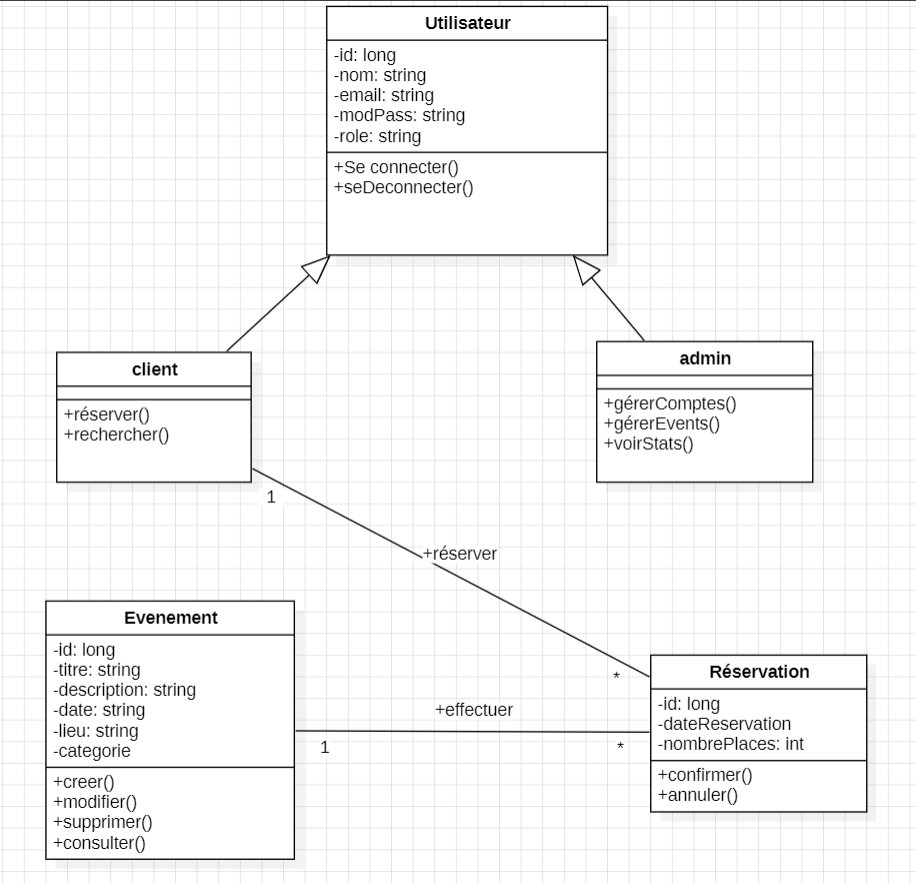
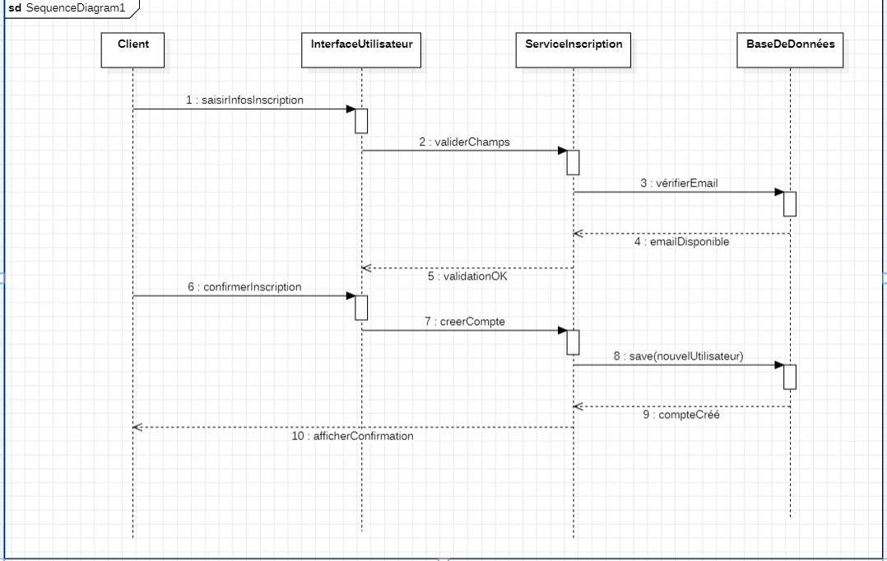

# 🎟️ Event Booking Web App

Application Web de réservation d’événements développée en Java avec Spring Boot. Le projet répond à des exigences fonctionnelles spécifiques pour deux profils : **clients** et **administrateurs**.


## 🧰 Technologies Utilisées

- Java 17
- Spring Boot
- Spring MVC
- Spring Security (JWT)
- Spring Data JPA
- MySQL / PostgreSQL
- JUnit
- Maven


## 🚀 Fonctionnalités Principales

### Pour les Clients :
- 🔍 Visualisation des événements en page d’accueil
- 📝 Inscription & Connexion (avec JWT)
- 👤 Gestion du profil utilisateur
- 🔎 Recherche & filtre des événements (date, lieu, catégorie)
- 🎟 Réservation d’événements
- 📃 Page "À propos" (équipe & valeurs)

### Pour les Administrateurs :
- 📊 Tableau de bord avec statistiques (inscriptions, réservations…)
- 👥 Gestion des comptes clients
- 📅 Gestion complète des événements


## ⚙️ Installation & Lancement

```bash
# Cloner le projet
git clone https://github.com/votre-utilisateur/event-booking-app.git
cd HelloEvents App

# Configuration de la base de données (src/main/resources/application.properties)
spring.datasource.url=jdbc:mysql://localhost:3306/table_db
spring.datasource.username=root
spring.datasource.password=your_password

```
### Diagramme de Cas d'Utilisation



### Diagramme de Classes



### Diagramme de Séquence

-🎯 Scénario : Un client s’inscrit sur la plateforme



